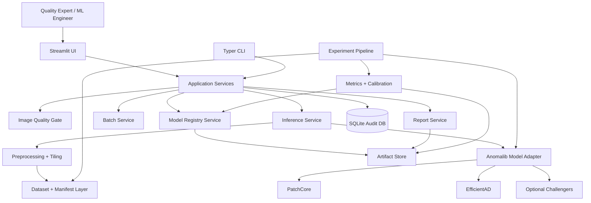
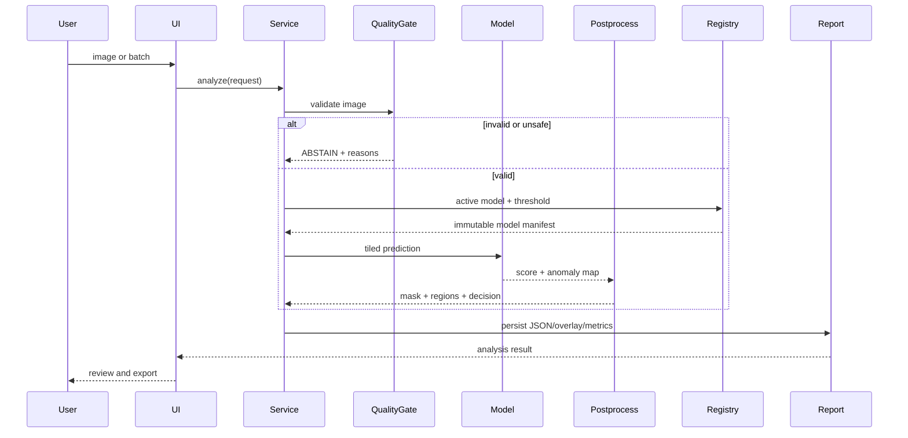

# WEAVEVISION — CURSOR MASTER BUILD SPECIFICATION

> **Belge türü:** Tek kaynaklı yürütme sözleşmesi
> **Hedef:** Cursor AI Agent’ın boş bir klasörden başlayarak çalışan, test edilmiş, ölçülmüş ve rapor üreten halı/kumaş görsel anomali tespit sistemini baştan sona kurması
> **Ürün adı:** `WeaveVision`
> **Teknik kapsam:** One-class / unsupervised industrial visual anomaly detection, anomaly localization, batch quality analytics, audit-ready reporting
> **Hedef donanım:** Windows veya Linux, NVIDIA RTX 4070 Laptop GPU; CPU fallback zorunlu
> **Ana teknoloji:** Python 3.11, PyTorch, Anomalib 2.5.0, PatchCore, EfficientAD, Streamlit, SQLite
> **Durum:** Normatif ve uygulanabilir ana belge
> **Belge önceliği:** Bu dosya, eski `.cursorrules`, eski üretken halı deseni belgeleri, README taslakları ve dağınık promptlardan üstündür.

---


## 0.0 MERINOS AI SUITE SINIRI

Bu belge yalnız `weavevision` anomali tespit ürününü yönetir. Ayrı ürün olan `carpet-designer` ile aşağıdaki sınırlar korunur:

- WeaveVision, desen üretmez, LoRA eğitmez ve prompt tabanlı tasarım sunmaz.
- Carpet Designer, kusur/anomali tespit etmez ve kalite kontrol kararı vermez.
- İki ürün aynı Python environment, model registry, veri seti veya SQLite veritabanını paylaşmaz.
- Paylaşılabilecek tek parçalar bağımsız, model-agnostic yardımcı kütüphanelerdir: güvenli görüntü I/O, yapılandırılmış logging, hash/provenance ve genel rapor şemaları.
- Paylaşılan kod, ayrı `shared-libs` paketi olarak sürümlenir; repository içi göreli import ile iki ürünü birbirine bağlamak yasaktır.
- Bu belgenin eş belgesi `MERINOS_CARPET_DESIGNER_CURSOR_MASTER_BUILD_SPEC.md` dosyasıdır; iki dosya birbirinin kabul kapısını değiştiremez.

## 0. CURSOR AGENT İÇİN BAŞLANGIÇ EMRİ

Bu depoyu sıfırdan kuran uygulama ajanısın. Bu dosyanın tamamını okumadan kod üretme.

Aşağıdaki kurallar bağlayıcıdır:

1. Bu belgeyi tek proje gerçeği olarak kabul et.
2. Eski `merinos-carpet-gan`, SDXL desen üretimi, LoRA tasarım üretimi ve kanıtsız FID sonuçlarını ana ürüne taşıma.
3. Projenin ana amacı **halı görsellerindeki anomalileri tespit etmek, yerini göstermek, ölçmek ve denetlenebilir rapora dönüştürmektir**.
4. Kullanıcıdan her faz için onay bekleme. Bir fazın kabul kapısı geçtiğinde sıradaki faza devam et.
5. Yalnız şu durumlarda dur:
   - lisans kabulü veya kullanıcı hesabı gerektiren veri seti fiziksel olarak indirilemiyorsa,
   - şirket verisi mevcut değilse,
   - gerekli GPU sürücüsü/işletim sistemi bağımlılığı kullanıcı müdahalesi gerektiriyorsa,
   - geri döndürülemez bir dış sistem işlemi gerekiyorsa.
6. Bir engel oluşursa sistemi yine de sentetik test fixture’larıyla kur, tüm unit/integration testlerini tamamla ve engeli `docs/BLOCKERS.md` içinde açıkça kaydet.
7. Başarı metriği uydurma. Çalıştırılmamış deney sonucu için yalnız `NOT_RUN` yaz.
8. Test verisini eğitim, eşik seçimi veya model seçimi için kullanma.
9. Her ana fazdan sonra:
   - testleri çalıştır,
   - lint ve type-check çalıştır,
   - üretilen kanıtları `artifacts/` altında kaydet,
   - `docs/EXECUTION_LOG.md` dosyasına komutları ve sonuçları ekle.
10. Kod, veri, deney ve ürün katmanlarını ayır.
11. Kullanıcı arayüzü model kodunu doğrudan çağırmamalı; `services/` katmanını kullanmalı.
12. Her sonuç; model sürümü, eşik sürümü, veri manifesti, ön işleme ayarı ve çalışma kimliğiyle izlenebilir olmalı.
13. Nihai ürün, veri seti olmadan açılabilmeli ve “model hazır değil” durumunu düzgün göstermeli.
14. Büyük model dosyalarını Git’e ekleme.
15. Bu belgedeki kabul kapıları geçmeden “tamamlandı” yazma.

### 0.1 İlk yürütme sırası

```text
workspace audit
    ↓
legacy cleanup and scope lock
    ↓
repository bootstrap
    ↓
environment doctor
    ↓
dataset governance and adapters
    ↓
MVTec AD carpet baseline
    ↓
PatchCore train/evaluate/calibrate
    ↓
inference/reporting service
    ↓
Streamlit UI
    ↓
EfficientAD challenger
    ↓
robustness/latency benchmark
    ↓
release package
    ↓
company-pilot readiness
```

### 0.2 İlk terminal komutları

```bash
git init
python --version
nvidia-smi
```

Python 3.11 yoksa kurulumu kullanıcıya bildir; Python 3.12/3.13 ile rastgele devam etme. GPU görünmüyorsa CPU modunda bootstrap ve testleri tamamla, GPU benchmark’ını bloke olarak kaydet.

---

# 1. NET TEKNİK HÜKÜM

## 1.1 İnşa edilecek sistem

WeaveVision, normal halı/kumaş görüntülerinden öğrenerek yeni görüntülerdeki olağandışı bölgeleri:

- görüntü düzeyinde işaretleyen,
- piksel düzeyinde ısı haritası üreten,
- kusurlu bölge maskesi ve konturları çıkaran,
- tekil ve toplu analiz yapan,
- sonuçları JSON, CSV ve HTML raporlarına dönüştüren,
- deney ve model sürümlerini izleyen,
- şirket verisi geldiğinde kontrollü pilot yapılmasına hazır

bir endüstriyel görsel kalite analizi sistemidir.

## 1.2 İnşa edilmeyecek sistem

Ana ürün şu işleri yapmayacaktır:

- halı deseni üretmek,
- “Merinos standardı” adıyla kanıtsız üretim kuralı tanımlamak,
- boya reçetesi önermek,
- dokuma makinesi parametresi belirlemek,
- fiziksel dayanıklılık tahmin etmek,
- kusur türünü etiketli veri olmadan kesin sınıflandırmak,
- gerçek olasılık kalibrasyonu yapılmadan anomaly score’u “güven yüzdesi” diye göstermek,
- açık kaynak benchmark sonucunu şirket performansı gibi sunmak,
- şirket izni olmadan marka ortaklığı veya üretim entegrasyonu iddia etmek,
- insan kalite uzmanının nihai kararını otomatik olarak geçersiz kılmak.

## 1.3 Ürünün doğru adı

Repo adı:

```text
weavevision
```

Başlık:

```text
WeaveVision — Carpet Anomaly Detection and Quality Analytics
```

“Merinos” adı yalnız yetkili kurumsal kullanım varsa konfigürasyondaki `organization_name` alanına yazılabilir. Varsayılan marka nötrdür.

---

# 2. ESKİ SİSTEMDEN TEMİZLENECEK HATALAR

| Eski yaklaşım | Problem | Yeni hüküm |
|---|---|---|
| `merinos-carpet-gan` adı | Sistem GAN değil, SDXL kullanıyor; ayrıca amaç değişti | Repo `weavevision` |
| SDXL + LoRA desen üretimi | Anomali tespit hedefinden kopuk | Ana kapsam dışı |
| “2,500+ dataset” | Veri kaynağı ve hash yok | Yalnız manifest ile doğrulanmış sayılar |
| `FID 45.2`, renk uyumu `0.87`, tutarlılık `0.91` | Gerçek deney kanıtı yok | Çalıştırılmadan metrik yazılmaz |
| “Gerçek halıdan ayırt edilemez” | FID böyle bir hüküm vermez | Yasak claim |
| RGB Öklid renk mesafesi | Algısal renk uyumu için yetersiz | Ana ürün renk uyumu iddia etmez |
| CLIP ortalama benzerliğinden benzersizlik | Bilimsel olarak zayıf ve koleksiyon kapsamına bağımlı | Ana ürün dışı |
| Her görseli merkezden kare kırpma | Kusuru kesebilir, geometrik bağlamı bozar | Aspect-ratio koruma + tiled inference |
| Streamlit içinde ağır model mantığı | Test edilemez, sıkı bağlı | `services/` katmanı |
| Rastgele train/test bölme | Aynı kaynak görüntüden tile sızıntısı | Parent-image/group split |
| Test setiyle eşik belirleme | Veri sızıntısı | Yalnız validation calibration |
| “accuracy” odaklı değerlendirme | Dengesiz anomaly görevinde yanıltıcı | AUROC, AP, recall@FPR, AUPRO, latency |
| Tek başarı skoru | Endüstriyel hata profili görünmez | FP, FN, defect-wise recall, latency, memory |
| Model yokken uygulamanın çökmesi | Ürün kalitesi zayıf | Degraded-ready UI |
| MVTec’i ticari veri gibi kullanmak | Lisans non-commercial | Lisans ayrımı ve kullanım uyarısı |
| Eski `.cursorrules` tek dosya/TODO zorlaması | Uçtan uca kurulumu engelliyor | Fazlı fakat otonom yürütme |

---

# 3. CLAIM VE KANIT SÖZLEŞMESİ

## 3.1 İzinli claim’ler

Aşağıdaki cümleler ancak karşılarındaki kanıt üretildiyse kullanılabilir:

| Claim | Zorunlu kanıt |
|---|---|
| “Sistem görüntü düzeyinde anomali tespit eder.” | Sealed test image AUROC/AP ve confusion matrix |
| “Sistem kusuru lokalize eder.” | Pixel AUROC/AP/AUPRO ve örnek overlay’ler |
| “RTX 4070 üzerinde çalışır.” | GPU adı, CUDA, p50/p95 latency ve VRAM ölçümü |
| “CPU fallback desteklenir.” | CPU smoke inference testi |
| “Batch analiz yapar.” | En az 20 fixture ile integration testi |
| “Rapor izlenebilirdir.” | JSON schema testi ve model/threshold hash alanları |
| “Şirket verisine hazırdır.” | Company pilot import contract ve runbook |
| “Model X daha iyidir.” | Aynı split, preprocessing ve metric contract ile karşılaştırma |
| “Üretime hazırdır.” | Tüm release gates + şirket verisi pilotu + uzman threshold kilidi |

## 3.2 Yasak claim’ler

Şunları yazma:

- “%99 doğru”
- “kusurları garanti tespit eder”
- “insan uzmanından daha iyi”
- “üretim kaybını %X azaltır”
- “Merinos kalite standardına uygundur”
- “gerçek zamanlıdır” — latency eşiği tanımlanmadan
- “confidence %92” — kalibrasyon yapılmadan
- “tamamen otonom kalite kontrol”
- “ticari kullanım serbest” — veri/model lisansı doğrulanmadan

## 3.3 Sonuç durumu sözlüğü

Her ölçüm şu statülerden biriyle tutulur:

```text
NOT_RUN
PASS
FAIL
BLOCKED
PASS_WITH_RESTRICTIONS
```

`PASS_WITH_RESTRICTIONS`, eksikleri gizlemek için kullanılmaz. Kısıt açıkça yazılır.

---

# 4. KULLANIM SENARYOLARI

## 4.1 Birincil kullanıcılar

1. **Kalite uzmanı**
   - Tek veya toplu halı görüntüsü yükler.
   - Anomali ısı haritasını inceler.
   - Yanlış pozitif/yanlış negatif geri bildirimi verir.
   - Analiz raporunu indirir.

2. **ML mühendisi**
   - Veri seti hazırlar.
   - Model eğitir.
   - Eşik kalibre eder.
   - Benchmark karşılaştırması yapar.
   - Model sürümü yayınlar.

3. **Teknik yönetici**
   - Model performans özetini görür.
   - İşlem süresi, hata oranı ve açık riskleri inceler.
   - Pilot raporunu dışa aktarır.

## 4.2 Temel kullanıcı hikâyeleri

```text
US-01: Kullanıcı bir görüntü yüklediğinde sistem veri kalite kontrolü yapar.
US-02: Geçerli görüntü için anomaly score ve heatmap üretir.
US-03: Eşik üstü bölgeleri kontur ve maske olarak gösterir.
US-04: Sonuç normal/anomaly/review/abstain durumlarından biri olur.
US-05: Kullanıcı bir klasör/ZIP yükleyerek batch analiz yapar.
US-06: Batch sonuçları skor, alan, karar ve gecikme ile sıralanır.
US-07: Kullanıcı overlay, mask, CSV, JSON ve HTML raporu indirir.
US-08: Her analiz model sürümü ve threshold sürümüyle kaydedilir.
US-09: Model yoksa UI açık kalır ve kurulum adımını gösterir.
US-10: Kullanıcı benchmark sayfasında gerçek deney sonuçlarını görür.
US-11: Kalite uzmanı sonucu kabul/red/yanlış alarm olarak işaretleyebilir.
US-12: Şirket verisi geldiğinde yeni veri manifesti içeri alınabilir.
```

---

# 5. KAPSAM

## 5.1 MVP kapsamı

- Open-source benchmark veri seti adaptörleri
- MVTec AD `carpet` kategorisi
- Normal-only eğitim
- PatchCore baseline
- EfficientAD challenger
- Görüntü ve piksel düzeyi değerlendirme
- Validation-only threshold calibration
- Yüksek çözünürlüklü tiled inference
- Görüntü kalite kapısı
- ABSTAIN durumu
- Tekli ve batch inference
- Streamlit arayüzü
- SQLite analiz kaydı
- JSON/CSV/HTML rapor
- Unit, integration ve smoke testleri
- CPU/GPU latency benchmark
- Reproducible experiment manifests
- Windows PowerShell ve Bash çalıştırma komutları

## 5.2 Araştırma kapsamı

MVP geçtikten sonra:

- PaDiM veya FastFlow karşılaştırması
- Tiling ablation
- Coreset ratio ablation
- Domain shift testi
- Açık kaynak kumaş veri setleri arası genelleme
- Synthetic anomaly augmentation
- Diffusion/inpainting tabanlı kusur üretimi
- Few-shot company adaptation
- Expert-feedback threshold recalibration

## 5.3 Kapsam dışı

- Kamera/PLC entegrasyonu
- Gerçek üretim hattı durdurma komutu
- Halı kusur tip sınıflandırıcısı
- Fiziksel kalite puanı
- Dört puan kumaş kalite sistemi
- Renk reçetesi veya Pantone yönetimi
- ERP/MES entegrasyonu
- Cloud multi-tenant SaaS
- Mobil uygulama
- Kullanıcı kimlik yönetimi
- Tasarım üretimi
- Marka özel model claim’i

---

# 6. BİLİMSEL PROBLEM TANIMI

Normal görüntü dağılımı:

\[
x \sim P_{\text{normal}}
\]

Model, yalnız normal eğitim örnekleri kullanarak:

- görüntü anomaly skoru \(s_I(x)\),
- piksel anomaly haritası \(A(x)\in\mathbb{R}^{H\times W}\)

üretir.

Görüntü kararı:

\[
\hat{y}_I =
\begin{cases}
\text{ANOMALY}, & s_I(x) \ge \tau_I \\
\text{NORMAL}, & s_I(x) < \tau_I
\end{cases}
\]

Piksel maskesi:

\[
\hat{M}_{ij} =
\mathbb{1}[A_{ij}(x)\ge\tau_P]
\]

Burada:

- \(\tau_I\): image-level threshold
- \(\tau_P\): pixel-level threshold
- iki eşik yalnız validation verisinden türetilir
- test seti eşik seçimine katılmaz.

ABSTAIN kararı ayrıca bir kalite/OOD kapısından gelir:

\[
\hat{y}(x)=\text{ABSTAIN}
\quad\text{if}\quad
q(x)<\tau_q \;\lor\; d_{\text{ood}}(x)>\tau_{\text{ood}}
\]

Bu ilk sürümde OOD kararı “evrensel OOD” olarak sunulmayacaktır. Yalnız:

- bozuk dosya,
- çok düşük çözünürlük,
- aşırı bulanıklık,
- aşırı pozlama,
- desteklenmeyen kanal biçimi,
- normal embedding dağılımından aşırı uzaklık

için review/abstain mekanizmasıdır.

---

# 7. SİSTEM MİMARİSİ

## 7.1 Mimari hüküm

İlk sürüm **modüler monolit** olacaktır. Mikroservis yazılmayacaktır.

Neden:

- tek kullanıcı/tek iş istasyonu hedefi,
- RTX 4070 laptop,
- daha kolay test ve dağıtım,
- model, rapor ve UI sınırları yine korunabilir,
- gereksiz ağ ve kuyruk karmaşıklığı oluşmaz.

## 7.2 Bileşen diyagramı



## 7.3 Veri akışı



---

# 8. REPOSITORY YAPISI

Cursor aşağıdaki yapıyı oluşturacaktır:

```text
weavevision/
├── .cursor/
│   └── rules/
│       └── weavevision.mdc
├── .github/
│   └── workflows/
│       ├── ci.yml
│       └── security.yml
├── .streamlit/
│   └── config.toml
├── configs/
│   ├── app.yaml
│   ├── datasets/
│   │   ├── mvtec_carpet.yaml
│   │   ├── visa.yaml
│   │   ├── aitex.yaml
│   │   └── company_template.yaml
│   ├── models/
│   │   ├── patchcore_baseline.yaml
│   │   ├── efficientad_challenger.yaml
│   │   └── padim_optional.yaml
│   └── experiments/
│       ├── smoke.yaml
│       ├── benchmark_mvtec_carpet.yaml
│       └── robustness.yaml
├── data/
│   ├── external/
│   │   └── .gitkeep
│   ├── interim/
│   │   └── .gitkeep
│   ├── processed/
│   │   └── .gitkeep
│   ├── fixtures/
│   │   ├── normal/
│   │   ├── anomaly/
│   │   └── masks/
│   └── manifests/
│       └── .gitkeep
├── docs/
│   ├── ARCHITECTURE.md
│   ├── CLAIM_CONTRACT.md
│   ├── DATASET_AND_LICENSE_REGISTER.md
│   ├── EXPERIMENT_PROTOCOL.md
│   ├── USER_GUIDE.md
│   ├── COMPANY_PILOT_RUNBOOK.md
│   ├── BLOCKERS.md
│   └── EXECUTION_LOG.md
├── artifacts/
│   ├── experiments/
│   ├── models/
│   ├── reports/
│   ├── benchmarks/
│   └── samples/
├── scripts/
│   ├── bootstrap.ps1
│   ├── bootstrap.sh
│   ├── download_visa.py
│   ├── verify_mvtec.py
│   ├── import_aitex.py
│   └── release_check.py
├── src/
│   └── weavevision/
│       ├── __init__.py
│       ├── __main__.py
│       ├── cli.py
│       ├── settings.py
│       ├── logging_config.py
│       ├── domain/
│       │   ├── enums.py
│       │   ├── schemas.py
│       │   ├── errors.py
│       │   └── protocols.py
│       ├── data/
│       │   ├── manifest.py
│       │   ├── audit.py
│       │   ├── split.py
│       │   ├── tiling.py
│       │   ├── transforms.py
│       │   └── adapters/
│       │       ├── base.py
│       │       ├── mvtec_ad.py
│       │       ├── visa.py
│       │       ├── aitex.py
│       │       └── company.py
│       ├── models/
│       │   ├── factory.py
│       │   ├── anomalib_adapter.py
│       │   ├── registry.py
│       │   └── export.py
│       ├── evaluation/
│       │   ├── metrics.py
│       │   ├── calibration.py
│       │   ├── robustness.py
│       │   ├── benchmark.py
│       │   └── plots.py
│       ├── inference/
│       │   ├── quality_gate.py
│       │   ├── predictor.py
│       │   ├── postprocess.py
│       │   ├── regions.py
│       │   └── overlay.py
│       ├── services/
│       │   ├── training_service.py
│       │   ├── evaluation_service.py
│       │   ├── analysis_service.py
│       │   ├── batch_service.py
│       │   ├── feedback_service.py
│       │   ├── report_service.py
│       │   └── health_service.py
│       ├── persistence/
│       │   ├── database.py
│       │   ├── migrations.py
│       │   └── repositories.py
│       ├── reporting/
│       │   ├── html_report.py
│       │   ├── csv_report.py
│       │   ├── json_report.py
│       │   └── templates/
│       │       ├── analysis_report.html.j2
│       │       └── benchmark_report.html.j2
│       └── ui/
│           ├── app.py
│           ├── state.py
│           ├── components.py
│           └── pages/
│               ├── 1_Single_Analysis.py
│               ├── 2_Batch_Analysis.py
│               ├── 3_Review_and_Feedback.py
│               ├── 4_Benchmark.py
│               ├── 5_Model_Registry.py
│               └── 6_System_Health.py
├── tests/
│   ├── conftest.py
│   ├── unit/
│   ├── integration/
│   ├── contract/
│   └── smoke/
├── .env.example
├── .gitignore
├── .pre-commit-config.yaml
├── LICENSE
├── Makefile
├── pyproject.toml
├── README.md
├── uv.lock
└── WEAVEVISION_CURSOR_MASTER_BUILD_SPEC.md
```

## 8.1 Git’e eklenmeyecekler

```gitignore
.venv/
__pycache__/
.pytest_cache/
.mypy_cache/
.ruff_cache/
.coverage
htmlcov/
.env
.streamlit/secrets.toml

data/external/**
data/interim/**
data/processed/**
!data/**/.gitkeep
!data/fixtures/**

artifacts/models/**
artifacts/experiments/**
artifacts/reports/**
artifacts/benchmarks/**
!artifacts/**/.gitkeep

*.ckpt
*.pt
*.pth
*.onnx
*.xml
*.bin
*.engine
*.tar
*.zip
mlruns/
wandb/
```

Model manifestleri Git’e eklenebilir; ağır ağırlık dosyaları eklenmez.

---

# 9. CURSOR KURAL DOSYASI

Eski `.cursorrules` kullanılmayacaktır. Cursor aşağıdaki `.cursor/rules/weavevision.mdc` dosyasını oluşturacaktır:

```markdown
---
description: WeaveVision repository implementation rules
alwaysApply: true
---

# WeaveVision Agent Rules

- Read `WEAVEVISION_CURSOR_MASTER_BUILD_SPEC.md` before changing architecture.
- Implement phases in the specified order.
- Do not invent datasets, metrics, thresholds, model results, or business claims.
- Do not use test data for training, model selection, or threshold calibration.
- Keep UI thin; all logic must live in domain/services/inference/evaluation modules.
- Every public function must be typed.
- Every external path must use `pathlib.Path`.
- Never silently swallow exceptions.
- Use structured logging and actionable error messages.
- Preserve source-image identity in all splits and tile operations.
- Never commit datasets, model weights, secrets, or generated reports.
- Every new feature requires tests.
- Run `ruff`, `mypy`, and `pytest` before declaring a phase complete.
- Record real commands and outcomes in `docs/EXECUTION_LOG.md`.
- Mark missing experiments as `NOT_RUN`, never as passed.
- Continue autonomously unless blocked by license acceptance, missing external data, secrets, or hardware.
```

---

# 10. ORTAM VE BAĞIMLILIK SÖZLEŞMESİ

## 10.1 Python ve paket yönetimi

- Python: `>=3.11,<3.12`
- Paket yöneticisi: `uv`
- Anomalib: `2.5.0`
- CUDA tercihi: `cu126`
- CPU kurulumu desteklenir.
- Bağımlılıklar `uv.lock` ile kilitlenir.

## 10.2 `pyproject.toml` çekirdeği

Cursor geçerli bir `pyproject.toml` üretmelidir. Başlangıç bağımlılıkları:

```toml
[project]
name = "weavevision"
version = "0.1.0"
description = "Carpet anomaly detection and quality analytics"
requires-python = ">=3.11,<3.12"
dependencies = [
  "anomalib[cu126]==2.5.0",
  "streamlit>=1.49,<2",
  "pydantic>=2.11,<3",
  "pydantic-settings>=2.10,<3",
  "PyYAML>=6.0,<7",
  "numpy>=2.0,<3",
  "pandas>=2.2,<4",
  "Pillow>=11,<13",
  "opencv-python-headless>=4.10,<5",
  "scikit-image>=0.24,<1",
  "scikit-learn>=1.6,<2",
  "plotly>=6,<7",
  "jinja2>=3.1,<4",
  "typer>=0.16,<1",
  "rich>=14,<15",
  "orjson>=3.10,<4",
  "filelock>=3.18,<4",
  "psutil>=7,<8"
]

[project.optional-dependencies]
dev = [
  "pytest>=8.4,<9",
  "pytest-cov>=6.2,<7",
  "pytest-xdist>=3.8,<4",
  "ruff>=0.12,<1",
  "mypy>=1.16,<2",
  "pre-commit>=4.2,<5",
  "types-PyYAML>=6.0"
]

[project.scripts]
weavevision = "weavevision.cli:app"
```

Kurulum başarısız olursa sürüm düşürerek rastgele çözüm üretme. Hata mesajını kaydet; Anomalib/PyTorch uyumunu doğrula ve lock dosyasını başarılı ortamdan üret.

## 10.3 Bootstrap komutları

Windows:

```powershell
powershell -ExecutionPolicy Bypass -File scripts/bootstrap.ps1
```

Linux:

```bash
bash scripts/bootstrap.sh
```

Beklenen içerik:

```bash
uv venv --python 3.11
uv sync --extra dev
uv run pre-commit install
uv run weavevision doctor
```

CPU kurulumu için ayrı documented komut:

```bash
uv pip install "anomalib[cpu]==2.5.0"
```

## 10.4 Environment doctor

`weavevision doctor` şu kontrolleri yapmalıdır:

- Python sürümü
- OS
- NVIDIA GPU adı
- driver ve CUDA görünürlüğü
- `torch.cuda.is_available()`
- PyTorch sürümü
- Anomalib sürümü
- aktif cihaz
- yazılabilir artifact/data dizinleri
- disk boş alanı
- RAM
- model registry durumu
- SQLite bağlantısı
- fixture smoke inference durumu

Çıktı hem terminale hem `artifacts/benchmarks/system_doctor.json` dosyasına yazılır.

---

# 11. VERİ YÖNETİŞİMİ VE LİSANS

## 11.1 Temel kural

Açık kaynak veri seti, şirket verisinin yerine geçmez. Açık veri:

- pipeline geliştirmek,
- algoritmaları karşılaştırmak,
- rapor ve arayüzü doğrulamak,
- deney protokolünü kanıtlamak

için kullanılır.

Şirket performansı yalnız şirket verisi pilotuyla ölçülür.

## 11.2 Veri seti kayıt tablosu

`docs/DATASET_AND_LICENSE_REGISTER.md` şu alanları içermelidir:

| Alan | Açıklama |
|---|---|
| dataset_id | Değişmez kısa kimlik |
| official_name | Resmî ad |
| version/date | Sürüm veya indirme tarihi |
| source_url | Resmî kaynak |
| license | Lisans |
| commercial_use | yes/no/unclear |
| download_method | manual/script |
| archive_sha256 | İndirilen arşiv hash’i |
| extracted_manifest_sha256 | Dosya manifest hash’i |
| categories | Kullanılan kategoriler |
| image_count | Gerçek sayım |
| normal_count | Gerçek sayım |
| anomaly_count | Gerçek sayım |
| mask_count | Gerçek sayım |
| intended_use | train/val/test/robustness |
| restrictions | Kısıtlar |
| verification_status | VERIFIED/BLOCKED |

## 11.3 Birincil veri seti: MVTec AD carpet

Amaç:

- ana baseline,
- normal-only train,
- image ve pixel evaluation,
- carpet texture odaklı ilk bilimsel kanıt.

Kısıtlar:

- resmî sitedeki lisans kabulü gerekir,
- ticari kullanım için uygun varsayılmaz,
- veri Git’e eklenmez,
- kullanıcı arşivi manuel indirdikten sonra `verify_mvtec.py` ile doğrulanır.

Beklenen yerleşim:

```text
data/external/mvtec_ad/carpet/
├── train/good/
├── test/good/
├── test/<defect_type>/
└── ground_truth/<defect_type>/
```

Komut:

```bash
uv run python scripts/verify_mvtec.py \
  --root data/external/mvtec_ad \
  --category carpet
```

Script:

- klasör yapısını doğrular,
- görüntüleri açmayı dener,
- boyutları sayar,
- mask-image eşleşmesini doğrular,
- duplicate hash kontrolü yapar,
- manifest üretir,
- hiçbir dosyayı sessizce silmez.

## 11.4 İkincil veri seti: VisA

Amaç:

- veri adaptörü genelliği,
- farklı endüstriyel domainlerde pipeline doğrulaması,
- ayrı benchmark.

VisA, carpet modeliyle birleştirilmiş eğitim verisi olarak kullanılmaz. Ayrı deney olarak tutulur.

## 11.5 İkincil tekstil veri seti: AITEX

Amaç:

- kumaş yüzey kusurları,
- yüksek yatay çözünürlük,
- maskeli tekstil anomaly testi,
- tiled inference testi.

Kurallar:

- kaynağın lisansını veri indirmeden önce kaydet,
- görüntüleri MVTec ile rastgele karıştırma,
- kaynak görüntüden çıkarılan patch’leri group split ile ayır,
- aynı ana görüntünün patch’leri farklı split’lere geçemez.

## 11.6 Opsiyonel veri setleri

- MVTec AD 2: zor senaryolar ve distribution shift
- MVTec LOCO AD: mantıksal anomaly araştırması
- KolektorSDD2: surface defect supervised comparison
- DAGM 2007: synthetic texture defect comparison

Bunlar MVP kapısını bloke etmez.

## 11.7 Yasak veri uygulamaları

- Google Images scraping
- marka kataloglarını izinsiz eğitim verisi yapmak
- test görüntülerini train’e taşımak
- maskeleri kaybeden resize/crop
- dosya adından sınıf sızıntısı
- duplicate görüntüleri split’ler arasında tutmak
- lisanssız Kaggle mirror’ını “resmî kaynak” saymak
- hash/manifestsiz veri kullanmak

---

# 12. VERİ MANİFESTİ

Her dataset hazırlığında JSON manifest üretilir.

Örnek:

```json
{
  "schema_version": "1.0.0",
  "dataset_id": "mvtec_ad_carpet",
  "source": {
    "name": "MVTec AD",
    "category": "carpet",
    "license": "CC BY-NC-SA 4.0",
    "commercial_use": false,
    "retrieved_at": "ISO-8601",
    "source_url": "official-source"
  },
  "counts": {
    "images_total": 0,
    "train_normal": 0,
    "validation_normal": 0,
    "validation_anomaly": 0,
    "test_normal": 0,
    "test_anomaly": 0,
    "masks": 0
  },
  "split_policy": {
    "method": "source-defined-or-grouped",
    "seed": 42,
    "group_key": "source_image_id",
    "test_used_for_calibration": false
  },
  "files": [
    {
      "relative_path": "carpet/train/good/000.png",
      "sha256": "...",
      "width": 0,
      "height": 0,
      "label": "normal",
      "defect_type": null,
      "mask_path": null,
      "source_image_id": "..."
    }
  ],
  "manifest_sha256": "..."
}
```

Manifest hash’i içerik canonical JSON’a dönüştürüldükten sonra hesaplanır.

---

# 13. SPLIT VE LEAKAGE SÖZLEŞMESİ

## 13.1 Öncelik

1. Resmî train/test split korunur.
2. Validation gerekiyorsa train normal örneklerinden deterministic group split yapılır.
3. Anomaly validation gerekiyorsa:
   - resmî validation varsa kullan,
   - yoksa test setinden eşik seçmek yasaktır,
   - synthetic validation yalnız açıkça `synthetic_calibration` olarak işaretlenebilir,
   - final test metriğiyle karıştırılmaz.

## 13.2 Parent-image split

Uzun AITEX görüntüsü patch’lere ayrılıyorsa:

```text
source image
    ↓ group assignment
train/val/test
    ↓
tiling
```

Şu sıra yasaktır:

```text
source image
    ↓ tiling
random patch split
```

## 13.3 Duplicate kontrolü

- exact SHA-256
- perceptual hash yakınlığı
- filename normalization
- source-image identity

Duplicate audit raporu:

```text
artifacts/experiments/<run_id>/data_leakage_audit.json
```

Kritik duplicate bulunursa deney `FAIL` olur.

---

# 14. ÖN İŞLEME VE TILING

## 14.1 Temel ilkeler

- Orijinal en-boy oranı korunur.
- Merkezden kör kare kırpma yapılmaz.
- Kusur maskesiyle aynı geometrik dönüşüm uygulanır.
- Normalize parametreleri model config’inde kaydedilir.
- Görsel EXIF orientation düzeltilir.
- RGB’ye kontrollü dönüşüm yapılır.
- 16-bit veya grayscale görüntüler sessizce yanlış dönüştürülmez.

## 14.2 Tiled inference

Yüksek çözünürlüklü halı görüntülerinde:

- tile size varsayılan: `512x512`
- overlap varsayılan: `%25`
- border mode: reflect veya configured padding
- tile batch size: VRAM’e göre
- birleşim: weighted overlap
- anomaly map orijinal koordinatlara geri örneklenir
- tile ID ve koordinatları result metadata’ya eklenir.

Ablation yapılacak parametreler:

```text
tile_size ∈ {256, 512, 768}
overlap ∈ {0.0, 0.25, 0.5}
```

MVP’de varsayılan 512/%25 kullanılır; optimum olduğu iddia edilmez.

## 14.3 Augmentation

PatchCore normal memory bank için ağır augmentation zorunlu değildir.

İzinli hafif dönüşümler:

- küçük parlaklık/kontrast değişimi,
- hafif renk jitter,
- gerektiğinde horizontal/vertical flip — desen yönü problem yaratmıyorsa,
- küçük geometrik dönüşüm.

Yasak:

- anomaly maskesini bozacak rastgele crop,
- yapısal kusuru normalleştiren blur,
- halı desenini anlamsızlaştıran agresif rotation,
- test-time augmentation sonucunu tek baseline ile karıştırmak.

Tüm augmentation’lar config ve seed ile kaydedilir.

---

# 15. GÖRÜNTÜ KALİTE KAPISI

`quality_gate.py` şu kontrolleri yapar:

1. Dosya açılabilir mi?
2. Desteklenen format mı?
3. Minimum boyut sağlanıyor mu?
4. Aspect ratio sınırları içinde mi?
5. Çok bulanık mı?
6. Aşırı karanlık mı?
7. Aşırı parlak mı?
8. Kanal ve bit depth uyumlu mu?
9. Dosya tamamen tek renk/boş mu?
10. OOD/referans uzaklığı aşırı mı?

## 15.1 Eşik ilkesi

Blur ve exposure eşikleri evrensel sabit “gerçek” olarak sunulmaz.

- Başlangıçta konservatif defaults kullanılır.
- Normal validation setindeki dağılımlar raporlanır.
- Final eşikler config’e yazılır.
- Quality gate eşiği de versioned artifact’tir.

## 15.2 Karar

```text
PASS
REVIEW
ABSTAIN
```

- `PASS`: inference yapılır.
- `REVIEW`: inference yapılabilir, raporda uyarı vardır.
- `ABSTAIN`: inference sonucu kalite kararı olarak kullanılmaz.

---

# 16. MODEL STRATEJİSİ

## 16.1 Birincil baseline: PatchCore

Seçilme gerekçesi:

- normal-only eğitim,
- patch-level localization,
- güçlü ve anlaşılabilir baseline,
- eğitimde klasik gradient optimizasyonu gerektirmeyen memory-bank yaklaşımı,
- consumer GPU üzerinde uygulanabilir,
- Anomalib içinde desteklenir.

Varsayılan config:

```yaml
model:
  name: patchcore
  backbone: wide_resnet50_2
  layers:
    - layer2
    - layer3
  coreset_sampling_ratio: 0.1
  num_neighbors: 9
  pre_trained: true

preprocessing:
  image_size: [512, 512]
  center_crop: null
  tiling:
    enabled: true
    tile_size: [512, 512]
    stride: [384, 384]

seed: 42
```

Config, kurulu Anomalib API’sine göre test edilerek uyarlanır. Geçersiz argümanları sessizce ignore etme.

## 16.2 Gecikme challenger: EfficientAD

Amaç:

- daha düşük latency,
- kabul edilebilir localization,
- RTX 4070 deployment adayı.

Varsayılan karşılaştırma aynı split ve preprocessing sözleşmesini kullanır.

Config:

```yaml
model:
  name: efficient_ad
  model_size: small
  teacher_out_channels: 384
  padding: false

trainer:
  max_epochs: 100

data:
  train_batch_size: 1
  eval_batch_size: 1

seed: 42
```

Epoch sayısı deney sonucuna göre değiştirilebilir; değişiklik manifestte yazılır.

## 16.3 Opsiyonel challenger

Öncelik sırası:

1. PaDiM
2. FastFlow
3. DRAEM
4. Reverse Distillation

Birincil ve challenger sonuçları alınmadan yeni model ekleme.

## 16.4 Model seçme kuralı

Tek metric kazananı seçilmez.

Model seçim matrisi:

| Boyut | Öncelik |
|---|---:|
| Recall at fixed normal FPR | Çok yüksek |
| Pixel localization AP/AUPRO | Yüksek |
| False negative count | Çok yüksek |
| p95 latency | Yüksek |
| Peak VRAM/RAM | Orta |
| Determinism/reproducibility | Yüksek |
| Export/deployment simplicity | Orta |
| Overall AUROC | Orta |

Final seçim `docs/MODEL_SELECTION_VERDICT.md` içinde gerekçelendirilir.

---

# 17. EĞİTİM PIPELINE’I

Komut:

```bash
uv run weavevision train \
  --config configs/experiments/benchmark_mvtec_carpet.yaml
```

Akış:

```text
load config
    ↓
validate dataset manifest
    ↓
validate split/leakage
    ↓
set deterministic seed
    ↓
create run_id
    ↓
fit model on normal train
    ↓
save checkpoint/memory bank
    ↓
predict validation
    ↓
calibrate thresholds
    ↓
freeze threshold artifact
    ↓
predict sealed test
    ↓
compute metrics
    ↓
generate reports and overlays
    ↓
register candidate model
```

## 17.1 Run ID

Format:

```text
YYYYMMDD_HHMMSS_<dataset>_<model>_<gitshortsha>
```

## 17.2 Run artifact yapısı

```text
artifacts/experiments/<run_id>/
├── config.resolved.yaml
├── environment.json
├── dataset_manifest.json
├── leakage_audit.json
├── seed.json
├── checkpoints/
├── thresholds.json
├── metrics.json
├── confusion_matrix.csv
├── per_image_predictions.csv
├── per_defect_metrics.csv
├── latency.json
├── memory.json
├── overlays/
├── plots/
├── report.html
└── run_manifest.json
```

## 17.3 Determinism

- Python, NumPy, PyTorch seed
- deterministic split seed
- config snapshot
- git commit SHA
- package lock hash
- GPU/driver info
- nondeterministic ops varsa uyarı

---

# 18. EŞİK KALİBRASYONU

## 18.1 Image threshold

Tercih sırası:

1. İş hedefi varsa `recall` maksimum, `normal FPR <= target`
2. İş hedefi yoksa validation F1 optimum
3. Anomaly validation yoksa normal-score quantile tabanlı provisional threshold

Provisional threshold açıkça işaretlenir:

```json
{
  "status": "PROVISIONAL_NORMAL_ONLY",
  "method": "normal_quantile",
  "quantile": 0.995
}
```

Bu threshold şirket üretim threshold’u değildir.

## 18.2 Pixel threshold

- validation mask varsa optimize edilir,
- yoksa normal map distribution üzerinden provisional çıkarılır,
- test maskesi kullanılmaz.

## 18.3 Threshold artifact

```json
{
  "schema_version": "1.0.0",
  "threshold_id": "thr_...",
  "model_id": "model_...",
  "dataset_manifest_sha256": "...",
  "image_threshold": 0.0,
  "pixel_threshold": 0.0,
  "method": "recall_at_fpr",
  "target_normal_fpr": 0.05,
  "calibration_split": "validation",
  "created_at": "...",
  "status": "LOCKED"
}
```

Threshold dosyası değiştirilemez. Yeni calibration yeni `threshold_id` üretir.

---

# 19. DEĞERLENDİRME METRİKLERİ

## 19.1 Görüntü düzeyi

Zorunlu:

- AUROC
- Average Precision
- F1 at locked threshold
- Precision
- Recall/Sensitivity
- Specificity
- False Positive count
- False Negative count
- Recall at fixed normal FPR
- Confusion matrix
- score distribution

## 19.2 Piksel düzeyi

Maskeler varsa:

- Pixel AUROC
- Pixel Average Precision
- AUPRO/PRO
- IoU at locked pixel threshold
- Dice/F1
- defect area error

## 19.3 Operasyonel

- inference latency p50/p95/p99
- preprocessing latency
- model latency
- report generation latency
- batch throughput
- peak VRAM
- peak RAM
- model artifact size
- startup time

## 19.4 Robustness

En az:

- brightness ±
- contrast ±
- mild Gaussian noise
- mild blur
- JPEG compression
- resize/downsample
- small rotation
- crop/occlusion stress
- lighting shift if dataset supports

Her perturbation’da delta metric raporlanır. Robustness verisi final test ile aynı amaçta tekrar tekrar optimize edilmez.

## 19.5 Sonuç yazma kuralı

Metric sonucu yalnız gerçek `metrics.json` içinden README/UI’ya aktarılır. README’ye elle sayı yazılmaz.

---

# 20. POSTPROCESSING VE BÖLGE ANALİZİ

Model çıktısı:

```text
raw image score
raw anomaly map
```

Postprocess:

1. map’i original size’a getir
2. optional Gaussian smoothing
3. pixel threshold uygula
4. küçük bağlı bileşenleri filtrele
5. contour çıkar
6. bounding box çıkar
7. area ratio hesapla
8. region peak/mean score hesapla
9. overlay üret
10. karar ve review priority üret

## 20.1 Region schema

```json
{
  "region_id": 1,
  "bbox_xyxy": [0, 0, 0, 0],
  "area_pixels": 0,
  "area_ratio": 0.0,
  "mean_anomaly_score": 0.0,
  "max_anomaly_score": 0.0,
  "centroid_xy": [0.0, 0.0],
  "contour": [[0, 0]]
}
```

## 20.2 Review priority

Etiketli fiziksel şiddet verisi olmadığı için “minor/major defect” iddiası yapılmaz.

Kullanılacak alan:

```text
review_priority:
  P0 = normal
  P1 = low anomaly evidence
  P2 = medium anomaly evidence
  P3 = high anomaly evidence
  ABSTAIN = invalid/unsafe input
```

Bu priority; anomaly score, area ratio ve peak map değerinin validation dağılımına göre normalize edilmesiyle üretilir. Formül ve ağırlıklar config’e kaydedilir. “Ürün kalite sınıfı” olarak sunulmaz.

---

# 21. ANALİZ SONUCU SÖZLEŞMESİ

`AnalysisResult` Pydantic modeli en az şu alanları içerir:

```json
{
  "schema_version": "1.0.0",
  "analysis_id": "ana_...",
  "run_id": "run_...",
  "created_at": "ISO-8601",
  "source": {
    "filename": "sample.png",
    "sha256": "...",
    "width": 0,
    "height": 0,
    "mode": "RGB"
  },
  "quality_gate": {
    "status": "PASS",
    "reasons": [],
    "metrics": {}
  },
  "model": {
    "model_id": "model_...",
    "model_name": "patchcore",
    "model_artifact_sha256": "...",
    "config_sha256": "..."
  },
  "threshold": {
    "threshold_id": "thr_...",
    "image_threshold": 0.0,
    "pixel_threshold": 0.0
  },
  "prediction": {
    "decision": "NORMAL",
    "raw_anomaly_score": 0.0,
    "normalized_anomaly_score": 0.0,
    "review_priority": "P0",
    "anomaly_area_ratio": 0.0,
    "region_count": 0
  },
  "regions": [],
  "artifacts": {
    "original_path": "...",
    "overlay_path": "...",
    "mask_path": "...",
    "heatmap_path": "...",
    "json_path": "..."
  },
  "timing_ms": {
    "quality_gate": 0.0,
    "preprocess": 0.0,
    "inference": 0.0,
    "postprocess": 0.0,
    "total": 0.0
  },
  "warnings": []
}
```

Kurallar:

- anomaly score “probability” değildir.
- path traversal engellenir.
- filename sanitize edilir.
- JSON schema contract test edilir.

---

# 22. MODEL REGISTRY

Model registry, ağır dosyaları değil metadata ve artifact path’i yönetir.

## 22.1 Model manifest

```json
{
  "schema_version": "1.0.0",
  "model_id": "model_...",
  "status": "CANDIDATE",
  "algorithm": "patchcore",
  "dataset_manifest_sha256": "...",
  "training_run_id": "...",
  "config_sha256": "...",
  "artifact_path": "...",
  "artifact_sha256": "...",
  "threshold_id": "...",
  "metrics_path": "...",
  "created_at": "...",
  "promoted_at": null,
  "promotion_reason": null
}
```

## 22.2 Durumlar

```text
CANDIDATE
VALIDATED
ACTIVE
RETIRED
REJECTED
```

Aynı anda yalnız bir `ACTIVE` model vardır.

## 22.3 Promotion

Model ancak:

- dataset manifest verified,
- leakage audit pass,
- test metrics present,
- threshold locked,
- latency measured,
- report generated,
- unit/integration tests pass

olduğunda `ACTIVE` olabilir.

Open-source benchmark modelinin statüsü:

```text
ACTIVE_BENCHMARK
```

Şirket modelinin statüsü ayrı tutulur:

```text
ACTIVE_COMPANY_PILOT
```

Benchmark modelini şirket üretim modeli gibi gösterme.

---

# 23. SQLITE VERİ MODELİ

SQLite, yerel denetim ve UI geçmişi için kullanılır.

Tablolar:

## `analyses`

- analysis_id PK
- created_at
- source_filename
- source_sha256
- decision
- review_priority
- raw_score
- normalized_score
- anomaly_area_ratio
- region_count
- model_id
- threshold_id
- quality_status
- total_latency_ms
- result_json_path

## `feedback`

- feedback_id PK
- analysis_id FK
- created_at
- reviewer
- verdict
- defect_type_optional
- comment
- corrected_mask_path_optional

Verdict:

```text
CONFIRMED_NORMAL
CONFIRMED_ANOMALY
FALSE_POSITIVE
FALSE_NEGATIVE
UNSURE
```

## `models`

- model_id PK
- algorithm
- status
- artifact_path
- artifact_sha256
- metrics_path
- created_at

## `thresholds`

- threshold_id PK
- model_id
- image_threshold
- pixel_threshold
- method
- status
- created_at

Migration sistemi idempotent olmalıdır.

---

# 24. SERVİS KATMANI

## 24.1 `AnalysisService`

Sorumluluk:

- request validation
- quality gate
- model/threshold resolve
- inference
- postprocess
- persist
- report artifact üretimi

UI’ya framework-agnostic result döndürür.

## 24.2 `BatchService`

- dosya keşfi
- güvenli ZIP extraction
- duplicate input detection
- progress callback
- per-item isolation
- partial failure handling
- batch summary
- CSV/HTML export

Bir dosya bozuksa tüm batch çökmez.

## 24.3 `TrainingService`

- config resolve
- dataset manifest validation
- training
- checkpoint
- environment capture
- run manifest

## 24.4 `EvaluationService`

- sealed test
- metric computation
- plots
- defect-wise breakdown
- calibration separation

## 24.5 `ReportService`

- analysis report
- batch report
- benchmark report
- consistent schema
- no invented narrative

## 24.6 `HealthService`

- environment
- active model
- registry integrity
- disk
- DB
- writable paths
- GPU
- last smoke test

---

# 25. CLI SÖZLEŞMESİ

Typer tabanlı CLI:

```bash
weavevision doctor

weavevision dataset audit \
  --config configs/datasets/mvtec_carpet.yaml

weavevision dataset prepare \
  --config configs/datasets/aitex.yaml

weavevision train \
  --config configs/experiments/benchmark_mvtec_carpet.yaml

weavevision calibrate \
  --run-id <run_id>

weavevision evaluate \
  --run-id <run_id> \
  --split test

weavevision infer \
  --input path/to/image.png \
  --output artifacts/reports

weavevision batch \
  --input path/to/folder \
  --output artifacts/reports

weavevision benchmark \
  --config configs/experiments/robustness.yaml

weavevision model list
weavevision model show --model-id <id>
weavevision model promote --model-id <id>

weavevision serve
```

Her komut:

- exit code kullanır,
- human-readable terminal çıktısı verir,
- `--json` ile machine-readable çıktı verir,
- log dosyası üretir,
- kritik parametreleri config snapshot’a yazar.

---

# 26. STREAMLIT ARAYÜZÜ

## 26.1 Tasarım ilkeleri

- UI, model olmadığında çökmez.
- “Anomaly score” doğru adla gösterilir.
- “Confidence” kelimesi kullanılmaz.
- Benchmark ve company-pilot sonuçları karıştırılmaz.
- Uyarı ve ABSTAIN görünürdür.
- Model ID, threshold ID ve run ID sonuçta görünür.
- Büyük görüntüler için performanslı thumbnail kullanılır.
- Orijinal/heatmap/overlay/mask yan yana incelenebilir.

## 26.2 Sayfalar

### Ana sayfa

- sistem amacı
- aktif model durumu
- dataset mode
- son benchmark özeti
- kısıtlar
- quick start

### Single Analysis

- image upload
- quality gate
- analysis
- visual result
- regions table
- timing
- downloads
- feedback

### Batch Analysis

- folder/ZIP
- item count
- progress
- failures
- sortable result table
- gallery
- exports

### Review and Feedback

- filters
- false positive/negative marking
- comments
- feedback export

### Benchmark

- model comparison
- image metrics
- pixel metrics
- latency
- robustness deltas
- experiment status

### Model Registry

- model list
- status
- data hash
- threshold
- promotion eligibility

### System Health

- GPU/CPU
- package versions
- disk/RAM
- active paths
- DB status
- smoke test

## 26.3 UI kabul kriterleri

- model yokken tüm sayfalar açılır,
- invalid upload kullanıcı dostu mesaj verir,
- 20 fixture batch işlenir,
- download dosyaları açılabilir,
- Streamlit state tekrar çalıştırmada sonucu kaybetmez,
- UI test edilemeyen iş mantığı içermez.

---

# 27. RAPORLAMA

## 27.1 Tekil analiz raporu

HTML raporda:

- source image
- decision
- anomaly score
- locked threshold
- review priority
- anomaly area ratio
- region table
- overlay/mask
- quality gate
- model ID
- threshold ID
- timing
- warnings
- claim disclaimer

## 27.2 Batch raporu

- toplam görüntü
- normal/anomaly/review/abstain
- başarısız dosya
- anomaly score histogram
- top anomalies
- latency distribution
- per-image table
- model and threshold identity

## 27.3 Benchmark raporu

- dataset identity and license
- split policy
- leakage audit
- model configs
- locked threshold
- all metrics
- defect-wise metrics
- latency and memory
- robustness
- failure gallery
- final verdict
- known limitations

## 27.4 Export formatları

Zorunlu:

```text
JSON
CSV
HTML
PNG overlay
PNG mask
PNG heatmap
```

PDF opsiyoneldir. HTML “Print to PDF” uyumlu olmalıdır. Sistem bağımlılıkları çözülmeden ağır PDF motoru ekleme.

---

# 28. GÖRSELLEŞTİRME KURALLARI

Overlay:

- orijinal görüntü görünür kalmalı,
- heatmap alpha kullanıcıya gösterilmeli,
- kontur çizgileri net olmalı,
- renk körlüğü açısından okunabilir palet seçilmeli,
- “kırmızı = kesin kusur” iddiası yapılmamalı,
- score range legend bulunmalı.

Failure gallery sınıfları:

```text
true_positive
true_negative
false_positive
false_negative
abstain
```

Her görselde:

- filename
- true label
- predicted decision
- raw score
- threshold
- defect type
- model ID

yer alır.

---

# 29. TEST STRATEJİSİ

## 29.1 Unit test

En az:

- manifest canonical hash
- dataset audit
- source-group split
- duplicate detection
- tile coordinates
- tile merge
- mask resize
- quality gate
- threshold calibration
- metric edge cases
- connected components
- region extraction
- overlay dimensions
- result schema
- registry state transitions
- DB repositories
- safe ZIP extraction
- report rendering
- path sanitization

## 29.2 Contract test

- JSON schema
- config schema
- manifest schema
- model manifest schema
- threshold artifact schema
- CLI exit codes
- report required fields

## 29.3 Integration test

- fixture dataset → train smoke → infer → report
- model registry → active model resolve
- batch partial failure
- feedback save/load
- Streamlit service invocation without UI

## 29.4 Smoke test

- CPU fixture inference
- GPU fixture inference if available
- 1 normal + 1 anomaly fixture
- report artifacts
- SQLite persistence

## 29.5 Test data

Fixture’lar:

- küçük, lisans uyumlu veya programatik üretilmiş,
- yalnız pipeline doğrulama için,
- benchmark metriği üretmek için kullanılmaz.

## 29.6 Kalite kapıları

```bash
uv run ruff check .
uv run ruff format --check .
uv run mypy src
uv run pytest -q
uv run pytest --cov=weavevision --cov-report=term-missing
```

Hedef:

- core domain/services/evaluation için ≥ %85 coverage
- UI dosyaları coverage hedefini yapay yükseltmek için ölçülmeyebilir
- kritik modüllerde eksik branch testleri kabul edilmez.

---

# 30. GÜVENLİK VE GİZLİLİK

- Yüklenen dosya adı güvenli hale getirilir.
- ZIP path traversal engellenir.
- Maksimum upload boyutu config’te.
- Decompression bomb kontrolü.
- PIL maximum pixels limiti kontrollü.
- Arbitrary pickle yükleme yasak.
- Model artifact hash doğrulanır.
- Kullanıcı yüklemeleri üçüncü taraf servise gönderilmez.
- Varsayılan çalışma on-premise/yereldir.
- `.env` ve secrets Git’e girmez.
- Loglarda tam kullanıcı path’i opsiyonel olarak maskelenir.
- Şirket verisi training cache’ine açıkça izin olmadan kopyalanmaz.
- Telemetry varsayılan kapalıdır.

---

# 31. LOGGING VE GÖZLEMLENEBİLİRLİK

Structured log alanları:

```text
timestamp
level
event
run_id
analysis_id
batch_id
model_id
threshold_id
dataset_id
duration_ms
device
error_code
```

Log seviyeleri:

- INFO: lifecycle
- WARNING: degraded/review
- ERROR: item failure
- CRITICAL: registry/data integrity

Loglar:

```text
artifacts/logs/weavevision.jsonl
```

Kişisel/veri içeriğini loglama.

---

# 32. CI/CD

## 32.1 GitHub Actions CI

CPU-only:

- checkout
- Python 3.11
- uv install
- ruff
- mypy
- unit tests
- contract tests
- fixture integration tests
- build package
- upload test report

Dataset ve büyük model indirilmez.

## 32.2 Security workflow

- dependency audit
- secret scan
- CodeQL veya Python static security scan
- artifact/package check

## 32.3 Release check

`scripts/release_check.py`:

- clean git state
- tests pass
- version present
- no large files
- no secrets
- model files not tracked
- docs present
- active model manifest valid
- benchmark report present or explicitly blocked
- license register complete

---

# 33. PERFORMANS BENCHMARK SÖZLEŞMESİ

## 33.1 Donanım kaydı

Her benchmark:

- CPU model
- RAM
- GPU
- GPU VRAM
- driver
- CUDA
- PyTorch
- OS
- power mode if known

## 33.2 Warmup

- en az 10 warmup inference
- en az 50 ölçümlü inference veya dataset boyutu kadar
- CUDA synchronize
- preprocessing/model/postprocess ayrı ölçülür
- batch size açıkça yazılır.

## 33.3 Latency sonucu

```json
{
  "device": "cuda",
  "image_size": [0, 0],
  "tile_size": [512, 512],
  "tile_count": 0,
  "warmup_runs": 10,
  "measured_runs": 50,
  "latency_ms": {
    "p50": 0.0,
    "p95": 0.0,
    "p99": 0.0,
    "mean": 0.0
  },
  "peak_vram_mb": 0.0,
  "throughput_images_per_second": 0.0
}
```

“Real-time” etiketi ancak ürün requirement’ı tanımlanıp p95 bu değeri geçerse kullanılabilir.

---

# 34. ROBUSTNESS PROTOKOLÜ

Her perturbation seviyeleri config ile tanımlanır.

Örnek:

```yaml
brightness:
  factors: [0.7, 0.85, 1.15, 1.3]
contrast:
  factors: [0.7, 0.85, 1.15, 1.3]
gaussian_noise:
  sigma: [5, 10, 20]
blur:
  kernel: [3, 5, 7]
jpeg:
  quality: [95, 75, 50]
rotation:
  degrees: [-5, 5]
downsample:
  scale: [0.75, 0.5]
```

Rapor:

- baseline metric
- perturbed metric
- absolute delta
- relative delta
- new FP/FN
- representative failures

Robustness sonucu eğitim için tekrar tekrar kullanılacaksa ayrı validation robustness seti gerekir.

---

# 35. DİFÜZYON ARAŞTIRMA KOLU

## 35.1 Hüküm

Difüzyon ana ürün değildir. Yalnız şu kapılar geçtikten sonra başlatılabilir:

- PatchCore gerçek open-source baseline tamamlandı,
- gerçek test metrics mevcut,
- failure analysis tamamlandı,
- hangi kusur tipinde veri kıtlığı olduğu gösterildi,
- synthetic görüntünün test setine sızmayacağı garanti edildi.

## 35.2 İzinli araştırma

```text
normal image + controlled mask
    ↓
inpainting / synthetic anomaly
    ↓
synthetic label and provenance
    ↓
train-only augmentation
    ↓
real-only sealed test evaluation
```

## 35.3 Zorunlu ablation

- real normal only
- real normal + classical synthetic defects
- real normal + diffusion synthetic defects

Final test yalnız gerçek anomaly görüntülerinden oluşur.

## 35.4 Yasak

- synthetic test sonucunu gerçek şirket başarısı gibi sunmak
- LoRA ile genel halı deseni üretip anomaly datası saymak
- kusur maskesi/provenance olmadan synthetic anomaly kullanmak
- diffusion augmentation başarısızken ürüne taşımak

---

# 36. ŞİRKET VERİSİ GELDİĞİNDE PİLOT

Açık veri sistem kurmak içindir. Nihai sonraki hedef kontrollü şirket pilotudur.

## 36.1 Pilot paketi

```text
tek bir halı deseni / SKU / üretim koşulu
        ↓
5–10 sağlam referans görüntüsü
        ↓
20–40 kör inceleme görüntüsü
        ↓
kalite uzmanından gerçek etiket
        ↓
WeaveVision batch analizi
        ↓
FP / FN / recall / latency / failure review
        ↓
şirkete özel eşik kilidi
```

## 36.2 Pilot ön koşulları

- aynı kamera ve aydınlatma kaydı
- görüntü çekim mesafesi
- çözünürlük
- desen/SKU identity
- normal/anomaly tanım sözleşmesi
- uzman etiketi
- mümkünse anomaly maskesi
- verinin kullanım izni
- veri saklama politikası

## 36.3 Pilot split

20–40 kör görüntü küçük bir veri setidir. Sonuçlar:

- istatistiksel güven aralığıyla,
- ham counts ile,
- “pilot” olarak

raporlanır.

Bu küçük örneklemle genel fabrika performansı iddia edilmez.

## 36.4 İlk deployment ilkesi

İlk şirket modeli:

```text
one pattern / one camera / one lighting / one threshold
```

Evrensel halı modeliyle başlanmaz.

---

# 37. FAZLAR VE KABUL KAPILARI

## M0 — Workspace Audit and Scope Lock

Üretilecekler:

- legacy file inventory
- claim audit
- architecture decision
- old `.cursorrules` replacement
- repo initialization

Kabul:

- üretken tasarım ana kapsamdan çıkarılmış,
- kanıtsız metrikler silinmiş,
- bu master spec root’ta,
- Git initialized.

## M1 — Repository Bootstrap

Üretilecekler:

- tree
- pyproject
- uv lock
- settings
- CLI skeleton
- logging
- docs skeleton
- tests skeleton

Kabul:

```bash
uv sync --extra dev
uv run weavevision doctor
uv run ruff check .
uv run mypy src
uv run pytest
```

pass.

## M2 — Dataset Governance

Üretilecekler:

- manifest
- license register
- MVTec verifier
- VisA downloader
- AITEX importer
- duplicate/leakage audit
- fixture dataset

Kabul:

- fixture manifest verified,
- MVTec missingse `BLOCKED` fakat verifier testleri pass,
- duplicate audit testleri pass.

## M3 — PatchCore Baseline

Üretilecekler:

- model factory
- anomalib adapter
- training service
- smoke config
- benchmark config
- candidate model manifest

Kabul:

- fixture smoke training/inference pass,
- real MVTec varsa baseline run complete,
- model artifact hash present.

## M4 — Evaluation and Calibration

Üretilecekler:

- metrics
- threshold calibration
- sealed test evaluator
- plots
- failure gallery
- benchmark report

Kabul:

- no test calibration,
- threshold artifact locked,
- metrics schema valid,
- FP/FN gallery generated.

## M5 — Inference and Reporting

Üretilecekler:

- quality gate
- tiling
- predictor
- postprocess
- overlays
- region analysis
- JSON/CSV/HTML reports
- SQLite persistence

Kabul:

- one-image end-to-end integration pass,
- batch partial failure pass,
- schema contract pass.

## M6 — Streamlit Product

Üretilecekler:

- pages
- model-not-ready state
- single/batch analysis
- review feedback
- benchmark
- health

Kabul:

- app starts,
- no active model state works,
- fixture inference from UI service works,
- downloads valid.

## M7 — EfficientAD Challenger

Üretilecekler:

- config
- training/evaluation
- same protocol comparison
- selection verdict

Kabul:

- same dataset/split/metrics,
- latency measured,
- no cherry-picked threshold.

## M8 — Robustness and Optimization

Üretilecekler:

- perturbation suite
- latency benchmark
- memory benchmark
- tiling/coreset ablation
- model selection

Kabul:

- deltas reported,
- p95 latency reported,
- failure cases visible.

## M9 — Release Package

Üretilecekler:

- README
- user guide
- company pilot runbook
- CI
- release check
- version tag readiness

Kabul:

- tests/lint/type check pass,
- no secrets/weights/data in Git,
- release manifest valid,
- limitations visible.

## M10 — Company Pilot Ready

Şirket verisi yoksa:

```text
PASS_WITH_RESTRICTIONS
restriction = company data unavailable
```

Şirket verisi varsa pilot uygulanır ve company threshold ayrı kilitlenir.

---

# 38. DOSYA BAZINDA UYGULAMA SÖZLEŞMESİ

## `settings.py`

- Pydantic Settings
- project root
- data/artifact/db paths
- max upload
- device preference
- active model alias
- no import-time side effects

## `domain/enums.py`

En az:

```text
Decision
QualityGateStatus
ReviewPriority
ModelStatus
ExperimentStatus
FeedbackVerdict
DatasetVerificationStatus
```

## `domain/schemas.py`

En az:

```text
SourceImageMetadata
QualityGateResult
RegionResult
PredictionResult
AnalysisResult
BatchResult
DatasetManifest
ModelManifest
ThresholdArtifact
BenchmarkResult
```

## `data/manifest.py`

- canonical JSON
- SHA-256
- validation
- read/write atomic

## `data/split.py`

- deterministic
- group-aware
- no source leakage
- audit output

## `data/tiling.py`

- tile creation
- coordinate bookkeeping
- weighted merge
- mask merge tests

## `models/factory.py`

- supported algorithm map
- explicit error on unknown model
- no dynamic arbitrary import

## `models/anomalib_adapter.py`

- fit
- predict
- export
- version compatibility checks
- framework objects hidden from services

## `evaluation/calibration.py`

- validation-only
- recall@FPR
- F1
- normal quantile provisional
- threshold artifact

## `inference/quality_gate.py`

- pure testable functions
- no UI dependency
- reasons list

## `inference/predictor.py`

- input image → prediction
- device management
- tiled mode
- timing
- no persistence responsibility

## `services/analysis_service.py`

- orchestration
- transaction boundary
- artifact paths
- DB persistence
- structured result

## `reporting/html_report.py`

- Jinja2
- autoescape
- embedded relative assets or copied report folder
- Turkish/English-safe text encoding

## `persistence/database.py`

- connection context manager
- WAL if appropriate
- schema version
- safe migrations

## `ui/app.py`

- page config
- health summary
- navigation
- no model training logic.

---

# 39. CONFIG SÖZLEŞMESİ

`configs/app.yaml`:

```yaml
app:
  name: WeaveVision
  organization_name: null
  environment: local
  language: tr
  max_upload_mb: 200
  telemetry: false

paths:
  data_root: data
  artifacts_root: artifacts
  database: artifacts/weavevision.sqlite3

runtime:
  device: auto
  precision: auto
  num_workers: 4
  deterministic: true
  seed: 42

inference:
  quality_gate_enabled: true
  tiling_enabled: true
  tile_size: [512, 512]
  tile_overlap: 0.25
  min_component_area_px: 16
  heatmap_alpha: 0.45

reporting:
  save_original_copy: false
  save_heatmap: true
  save_mask: true
  save_overlay: true
```

`company_template.yaml`:

```yaml
dataset:
  id: company_pattern_001
  organization: null
  pattern_id: required
  camera_id: required
  lighting_id: required
  root: required
  license_or_permission_ref: required
  split:
    method: group
    group_key: capture_session
    seed: 42
```

Config validation başarısızsa uygulama açık hata verir.

---

# 40. README SÖZLEŞMESİ

README gerçek durumu yansıtır.

Zorunlu bölümler:

1. problem
2. scope
3. architecture
4. quick start
5. dataset setup
6. train/evaluate
7. UI
8. reports
9. metrics — yalnız generated table
10. license restrictions
11. limitations
12. company pilot
13. reproducibility
14. security/privacy

README’de şu alanlar otomatik veya script ile güncellenir:

```text
latest verified run
model
dataset
metrics path
latency path
status
```

Kanıtsız pazarlama cümlesi yazılmaz.

---

# 41. HATA KODLARI

En az:

```text
WV_CONFIG_INVALID
WV_DATASET_NOT_FOUND
WV_DATASET_LICENSE_BLOCKED
WV_DATASET_STRUCTURE_INVALID
WV_DATA_LEAKAGE_DETECTED
WV_MODEL_NOT_READY
WV_MODEL_HASH_MISMATCH
WV_THRESHOLD_NOT_FOUND
WV_IMAGE_INVALID
WV_IMAGE_TOO_SMALL
WV_IMAGE_QUALITY_ABSTAIN
WV_INFERENCE_FAILED
WV_REPORT_FAILED
WV_DATABASE_FAILED
WV_GPU_UNAVAILABLE
WV_UNSUPPORTED_FORMAT
```

UI kullanıcıya teknik stack trace göstermez; logda saklar.

---

# 42. ACCEPTANCE TEST MATRİSİ

| ID | Test | Beklenen |
|---|---|---|
| AT-01 | Empty workspace bootstrap | Repo çalışır |
| AT-02 | No GPU | CPU doctor ve tests pass |
| AT-03 | No dataset | UI açılır, dataset blocked görünür |
| AT-04 | Corrupt image | ABSTAIN/error, crash yok |
| AT-05 | Tiny image | Quality gate |
| AT-06 | Normal fixture | End-to-end result |
| AT-07 | Synthetic anomaly fixture | Heatmap/mask produced |
| AT-08 | Batch with one corrupt | Partial success |
| AT-09 | ZIP traversal | Rejected |
| AT-10 | Duplicate across split | Leakage audit fail |
| AT-11 | Test calibration attempt | Rejected |
| AT-12 | Invalid model hash | Model load rejected |
| AT-13 | Missing threshold | No production decision |
| AT-14 | Report generation | JSON/CSV/HTML valid |
| AT-15 | Registry promotion | Only eligible model promoted |
| AT-16 | Streamlit no model | App stable |
| AT-17 | Real MVTec carpet | Metrics generated if available |
| AT-18 | RTX 4070 benchmark | p50/p95/VRAM generated if available |
| AT-19 | Feedback | Persist and export |
| AT-20 | Release check | Clean package |

---

# 43. DEFINITION OF DONE

Proje yalnız aşağıdakilerin tümü gerçekleşirse “MVP complete” sayılır:

- [ ] Bu master spec root’ta
- [ ] Eski GAN/SDXL scope ana üründen çıkarılmış
- [ ] Python 3.11 environment locked
- [ ] `weavevision doctor` çalışıyor
- [ ] Dataset license register var
- [ ] MVTec verifier var
- [ ] Dataset manifest ve hash var
- [ ] Leakage audit var
- [ ] PatchCore fixture smoke pass
- [ ] Real MVTec carpet run tamamlanmış veya açıkça blocked
- [ ] Threshold validation-only
- [ ] Image/pixel metrics var
- [ ] FP/FN gallery var
- [ ] Tiled inference var
- [ ] Quality gate ve ABSTAIN var
- [ ] Single analysis var
- [ ] Batch analysis var
- [ ] JSON/CSV/HTML reports var
- [ ] SQLite audit history var
- [ ] Feedback var
- [ ] Streamlit pages çalışıyor
- [ ] EfficientAD comparison tamamlanmış veya gerekçeli blocked
- [ ] p95 latency ve memory ölçülmüş veya hardware blocked
- [ ] Robustness raporu var
- [ ] Unit/integration/contract/smoke tests pass
- [ ] Ruff pass
- [ ] Mypy pass
- [ ] CI pass
- [ ] Git’te dataset/model/secrets yok
- [ ] README claim’leri artifact’lerden geliyor
- [ ] Company pilot runbook var
- [ ] Final verdict gerçek kısıtlarla yazılmış

---

# 44. SON TEKNİK HEDEF

Açık veriyle kurulacak ilk kanıt:

```text
MVTec AD carpet
    ↓
verified manifest
    ↓
PatchCore baseline
    ↓
validation-only threshold
    ↓
sealed test metrics
    ↓
heatmap and failure gallery
    ↓
Streamlit batch analysis
    ↓
latency and robustness report
```

Bundan sonraki hedef:

```text
tek şirket halı deseni
    ↓
5–10 sağlam referans
    ↓
20–40 kör görüntü
    ↓
uzman etiketi
    ↓
FP / FN / recall / p95 latency
    ↓
şirkete özel eşik kilidi
```

Şirket verisi olmadan “şirkete özel model tamamlandı” denmeyecektir.

---

# 45. RESMÎ TEKNİK KAYNAKLAR

Ajan, veri/model davranışı konusunda blog yerine öncelikle bu kaynakları kullanmalıdır.

## Anomalib

- Documentation: `https://anomalib.readthedocs.io/en/latest/`
- Getting started: `https://anomalib.readthedocs.io/en/latest/markdown/get_started/anomalib.html`
- Image models: `https://anomalib.readthedocs.io/en/latest/markdown/guides/reference/models/image/`
- PatchCore reference: `https://anomalib.readthedocs.io/en/latest/markdown/guides/reference/models/image/patchcore.html`
- Releases: `https://github.com/open-edge-platform/anomalib/releases`

## Datasets

- MVTec AD: `https://www.mvtec.com/research-teaching/datasets/mvtec-ad`
- MVTec AD 2: `https://www.mvtec.com/research-teaching/datasets/mvtec-ad-2`
- MVTec LOCO AD: `https://www.mvtec.com/research-teaching/datasets/mvtec-loco-ad`
- VisA registry: `https://registry.opendata.aws/visa/`
- AITEX/Fabric Defects dataset record: `https://data.mendeley.com/datasets/663j22s43c/3`

## Papers

- PatchCore: `https://arxiv.org/abs/2106.08265`
- MVTec AD paper and evaluation links are provided on the official dataset page.
- VisA/SPot-the-Difference citation is provided on the AWS Open Data registry.

## PyTorch

- Local installation selector: `https://pytorch.org/get-started/locally/`

---

# 46. FINAL AGENT VERDICT TEMPLATE

Cursor son fazda `docs/FINAL_VERDICT.md` üretmelidir:

```markdown
# WeaveVision Final Verdict

## Overall Status
PASS | FAIL | BLOCKED | PASS_WITH_RESTRICTIONS

## Implemented
- ...

## Verified Evidence
| Claim | Artifact | Status |
|---|---|---|
| ... | ... | ... |

## Real Metrics
Generated from:
- `artifacts/experiments/.../metrics.json`
- `artifacts/benchmarks/.../latency.json`

## Open Blockers
- ...

## Restrictions
- Open-source benchmark does not establish company production performance.
- MVTec license is non-commercial.
- Company threshold is not locked without company pilot data.

## Next Authorized Target
Company-controlled single-pattern pilot.
```

---

# 47. AJANIN YAPACAĞI İLK SOMUT İŞ

Bu dosya Cursor’a verildiğinde ilk görev şudur:

```text
1. Workspace’i tara.
2. Eski GAN/SDXL dosyalarını `legacy/` altında karantinaya al veya yeni repoya taşıma.
3. Bu belgede tanımlı repo ağacını oluştur.
4. `.cursor/rules/weavevision.mdc` dosyasını oluştur.
5. `pyproject.toml`, bootstrap scriptleri ve `weavevision doctor` komutunu tamamla.
6. Unit testleri yaz.
7. M1 kabul komutlarını çalıştır.
8. Sonuçları `docs/EXECUTION_LOG.md` içine kaydet.
9. Başarılıysa M2 veri yönetişimine otomatik devam et.
```

**İlk milestone tamamlanmadan model benchmark sonucu iddia etme.**

---

# 48. OPERASYONEL TAMLIK EKİ

Bu bölüm önceki bütün repository ve release hükümlerini tamamlar. Çelişki halinde daha sıkı olan kural uygulanır.

## 48.1 Production-path tamlık kuralı

Aktif üretim yolunda aşağıdakiler yasaktır:

- `TODO`, `FIXME` veya `HACK` ile bırakılmış zorunlu iş,
- yalnız `pass` içeren uygulama,
- sahte model çıktısı,
- sabit başarı sonucu,
- placeholder threshold veya metrik,
- yakalanıp sessizce yutulan istisna,
- testte geçsin diye production davranışını devre dışı bırakan koşul.

Ertelenen özellik aktif yoldan çıkarılır ve `docs/BLOCKERS.md` içinde `BLOCKED` veya `NOT_AUTHORIZED` olarak kaydedilir.

## 48.2 Paket ve dokümantasyon standardı

- `src/weavevision/` altındaki bütün Python paket dizinlerinde `__init__.py` bulunur.
- Public class, method ve function için type hints zorunludur.
- Public API için kısa Google-style docstring zorunludur.
- Docstring; parametreleri, dönüş değerini, domain exception'larını ve önemli side effect'leri belirtir.
- İstisnalar yalnız sorumluluk sınırlarında yakalanır: CLI, UI, dış I/O, batch item isolation ve persistence transaction.
- Her fonksiyonu genel `try/except Exception` ile sarmalamak yasaktır.

## 48.3 CHANGELOG

Repository kökünde `CHANGELOG.md` bulunur ve Keep a Changelog yaklaşımına yakın şu bölümleri kullanır:

```text
Unreleased
Added
Changed
Fixed
Security
Deprecated
Removed
```

Her milestone sonunda:

- `docs/EXECUTION_LOG.md`: gerçek komutlar ve çıktılar,
- `CHANGELOG.md`: kullanıcı açısından değişen davranış,
- `docs/BLOCKERS.md`: açık engeller

güncellenir.

## 48.4 Streamlit cache sözleşmesi

- Model registry, aktif model ve immutable service kaynakları `st.cache_resource` ile yüklenebilir.
- Cache key en az `model_id`, `artifact_sha256`, `threshold_id` ve kritik preprocessing hash'ini içermelidir.
- Kullanıcı yüklemeleri, analiz sonuçları ve kişisel geri bildirim global resource cache'e yazılmaz.
- Model promotion veya threshold değişikliğinde cache açıkça invalidate edilir.
- UI cache'i model registry'nin bütünlük kontrolünü bypass edemez.

## 48.5 Platform matrisi

| Platform | Destek seviyesi | Zorunlu kapı |
|---|---|---|
| Windows 11 + NVIDIA CUDA | Birincil | Evet, donanım varsa |
| Linux + NVIDIA CUDA | Birincil | Evet, donanım varsa |
| Windows/Linux CPU | Degraded fallback | Evet |
| macOS CPU | Best-effort geliştirme | Hayır |
| Apple MPS | Deneysel | Hayır |

MPS doğrulanmadan tam destek iddiası yazılmaz. `device=auto` yalnız test edilmiş backend'i seçer; desteklenmeyen backend için CPU'ya açık uyarıyla döner.

## 48.6 Notebook politikası

Opsiyonel notebook'lar:

```text
notebooks/
├── 01_dataset_audit_and_eda.ipynb
├── 02_patchcore_failure_analysis.ipynb
└── 03_model_comparison.ipynb
```

Kurallar:

- İş mantığı notebook içinde tutulmaz.
- Notebook yalnız `src/weavevision` public API'sini çağırır.
- Notebook çıktısı sealed benchmark artifact'i yerine geçmez.
- Notebook hücreleri temiz kernel üzerinde baştan sona çalışabilir olmalıdır.
- Büyük binary output Git'e eklenmez.

## 48.7 Docker profilleri

Repository şu dosyaları içerir:

```text
Dockerfile.cpu
Dockerfile.cuda
compose.yaml
compose.gpu.yaml
.dockerignore
```

### CPU profili

Amaç:

- UI ve servis sözleşmesini doğrulamak,
- fixture smoke inference çalıştırmak,
- model/dataset yok durumunu göstermek.

CPU imajında büyük benchmark veya üretim hızı iddia edilmez.

### CUDA profili

- NVIDIA CUDA runtime tabanlıdır.
- Host driver ile container CUDA uyumu belgelenir.
- NVIDIA Container Toolkit ön koşulu README'de yer alır.
- Model ağırlıkları image içine gömülmez; read-only volume veya artifact mount kullanılır.

### Compose güvenliği

- `.env` image içine `COPY` edilmez.
- Dataset ve artifact mount'ları açıkça tanımlanır.
- Container root olmayan kullanıcıyla çalışır.
- Healthcheck Streamlit portunun yanında `weavevision doctor --json` sonucunu da değerlendirir.

### Docker kabul komutları

```bash
docker build -f Dockerfile.cpu -t weavevision:cpu .
docker run --rm weavevision:cpu weavevision doctor --json
docker compose up --build
```

GPU varsa:

```bash
docker build -f Dockerfile.cuda -t weavevision:cuda .
docker compose -f compose.yaml -f compose.gpu.yaml up --build
```

## 48.8 Deployment profilleri

Öncelik sırası:

1. Yerel/on-premise iş istasyonu,
2. GPU Docker workstation,
3. CPU Docker demo,
4. model içermeyen Streamlit Community Cloud UI demonstrasyonu.

Community Cloud üzerinde büyük model inference veya şirket verisi kullanımı varsayılmaz. Cloud demo yalnız fixture veya kayıtlı örnek artifact'leri gösterebilir.

## 48.9 Repository ağacına ekler

Önceki ağaç aşağıdakilerle genişletilir:

```text
weavevision/
├── CHANGELOG.md
├── Dockerfile.cpu
├── Dockerfile.cuda
├── compose.yaml
├── compose.gpu.yaml
├── .dockerignore
└── notebooks/
    ├── 01_dataset_audit_and_eda.ipynb
    ├── 02_patchcore_failure_analysis.ipynb
    └── 03_model_comparison.ipynb
```

## 48.10 Ek kabul testleri

| ID | Test | Beklenen |
|---|---|---|
| AT-21 | Production TODO scan | Aktif kaynakta zorunlu TODO/pass yok |
| AT-22 | Public API docstrings | Eksik public docstring yok |
| AT-23 | Cache invalidation | Model/threshold değişince eski cache kullanılmaz |
| AT-24 | CPU Docker build | Image build ve doctor pass |
| AT-25 | Docker no-secret audit | Image layer'larında `.env`/token yok |
| AT-26 | macOS/unsupported device config | Açık uyarı ve güvenli CPU fallback |
| AT-27 | Notebook clean run | Mevcut environment'ta baştan sona çalışır veya BLOCKED |

---

# 49. NİHAİ HÜKÜM

Bu proje artık bir “AI halı deseni üreticisi” değildir.

Bu proje:

> **Normal referanslardan öğrenen, halı/kumaş yüzey anomalilerini lokalize eden, karar sınırlarını validation verisiyle kilitleyen, hata örneklerini açıkça gösteren ve her sonucunu model/veri/eşik kimliğiyle raporlayan yerel bir endüstriyel kalite analiz sistemidir.**

Başarı sırası:

```text
kanıtlanabilir veri
    ↓
sızıntısız deney
    ↓
PatchCore baseline
    ↓
kilitli eşik
    ↓
lokalizasyon
    ↓
operasyonel rapor
    ↓
uzman geri bildirimi
    ↓
şirket pilotu
```

Bu sıranın dışına çıkma.
